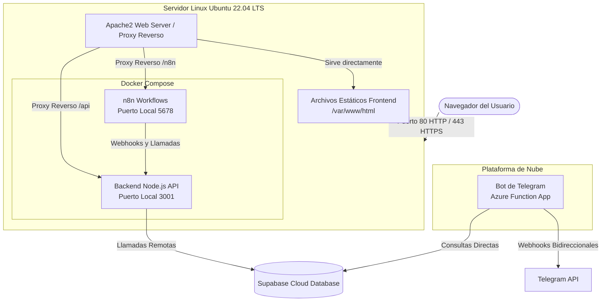

<div align="center">

# UNIVERSIDAD DE LAS AMÉRICAS (UDLA)
### FACULTAD DE INGENIERÍA Y CIENCIAS APLICADAS
### INGENIERÍA EN DESARROLLO DE SOFTWARE

<br><br><br>

# MANUAL DE DESPLIEGUE DE SISTEMA
## "Ecencia Andina"

<br><br><br>

**Autores:**  
Esteban Manuel Carvajal Landázuri  
Alexander Iván Rengifo Mantilla

**Tutor/Director:**  
Ing. Paulo Guerra Terán

<br><br><br>
**Quito, Ecuador**  
**Julio, 2026**

</div>

<div style="page-break-after: always"></div>

## Tabla de Contenidos
1. [Introducción y Objetivos del Despliegue](#1-introducci%C3%B3n-y-objetivos-del-despliegue)
2. [Arquitectura de Despliegue](#2-arquitectura-de-despliegue)
3. [Requerimientos y Prerrequisitos](#3-requerimientos-y-prerrequisitos)
4. [Gestión de Secretos y Configuración](#4-gesti%C3%B3n-de-secretos-y-configuraci%C3%B3n)
5. [Pasos Detallados de Instalación y Despliegue](#5-pasos-detallados-de-instalaci%C3%B3n-y-despliegue)
6. [Plan de Pruebas y Validación Post-Despliegue](#6-plan-de-pruebas-y-validaci%C3%B3n-post-despliegue)
7. [Plan de Rollback y Contingencia](#7-plan-de-rollback-y-contingencia)
8. [Mantenimiento y Monitoreo](#8-mantenimiento-y-monitoreo)

<div style="page-break-after: always"></div>

> [!IMPORTANT]
> **Documento Oficial de Titulación - Universidad de las Américas (UDLA)**
> Este documento describe de forma exhaustiva los procedimientos técnicos para el aprovisionamiento de infraestructura, instalación, configuración y monitoreo del sistema "Ecencia Andina" en entornos productivos.

---

## 1. Introducción y Objetivos del Despliegue

### 1.1 Propósito del Documento
El presente manual establece los lineamientos técnicos, prerrequisitos, pasos de configuración y validaciones necesarios para desplegar de manera exitosa la plataforma integral "Ecencia Andina" en un entorno de producción.

El sistema fue concebido bajo un enfoque *Cloud-Native* teniendo a **Microsoft Azure** como el proveedor principal (utilizando Azure Functions y Azure Virtual Machines) orquestado vía Terraform. Sin embargo, gracias a su arquitectura basada en contenedores, **el sistema mantiene portabilidad total y puede ser desplegado de forma manual (Agnóstica) en cualquier servidor o proveedor de nube** (AWS, Google Cloud, DigitalOcean) que soporte Linux y Docker, ya que incluso los componentes *Serverless* proveen métodos de ejecución contenerizada como respaldo.

### 1.2 Alcance
El alcance de este manual cubre el despliegue de los siguientes componentes:
*   **Aprovisionamiento Automatizado y Serverless (Microsoft Azure - Primario):**
    *   **Bot de Telegram:** Microservicio Serverless desplegado nativamente como una **Azure Function App** (independiente de la máquina virtual).
    *   **Infraestructura:** Creación de red, seguridad y servidores mediante Terraform y GitHub Actions (CI/CD).
*   **Despliegue Agnóstico (Cualquier Nube - Respaldo):**
    *   **Frontend (Cliente Web):** Despliegue de aplicación React + Vite servida mediante Apache2.
    *   **Backend (API Rest):** Aplicación Node.js/Express empacada en Docker.
    *   **Gestor de Workflows (n8n):** Contenedor Docker para orquestación de procesos y envíos automatizados.
    *   **Proxy Reverso:** Configuración de enrutamiento web con Apache2.
    *   **Base de Datos:** Conexiones hacia Supabase (servicios administrados).

---

## 2. Arquitectura de Despliegue

### 2.1 Diagrama Lógico de Despliegue



### 2.2 Justificación de Decisiones Arquitectónicas
*   **Portabilidad Parcial (Docker y Serverless):** El uso de Docker Compose encapsula todas las dependencias del backend y n8n, garantizando que el sistema base funcione idénticamente en cualquier servidor físico o de nube. Sin embargo, el **Bot de Telegram** se abstrajo como una Azure Function (Serverless) para garantizar una respuesta instantánea de microsegundos ante los webhooks de Telegram, independizando su carga de trabajo del servidor principal.
*   **Proxy Reverso (Apache2):** Permite aislar los puertos y resolver el enrutamiento de la SPA de React sin problemas de CORS, dirigiendo transparentemente `/api` al entorno interno Docker en el puerto `3001`, y `/n8n` al puerto `5678`.
*   **Contenedorización del Backend:** Se consolidan el backend y n8n bajo el mismo `docker-compose.yml`, compartiendo recursos, red interna y variables de entorno.
*   **Integración y Despliegue Continuo (CI/CD):** La carga principal del despliegue del bot de Telegram hacia Azure Functions se realiza de forma automatizada mediante un pipeline de GitHub Actions (`main.yml`), el cual sincroniza las variables de entorno de Azure y publica la función.

---

## 3. Requerimientos y Prerrequisitos

### 3.1 Hardware / Recursos de Nube Mínimos
*   **Servidor:** Máquina Virtual Linux.
*   **Sistema Operativo:** Ubuntu Server 22.04 LTS.
*   **Recursos:** Mínimo 2 vCPUs, 8 GB de Memoria RAM.
*   **Almacenamiento:** Disco de Estado Sólido (SSD) de 30 GB Mínimo.

### 3.2 Software y Herramientas Locales
El entorno de desarrollo desde donde se ejecutará el despliegue (Máquina Windows del desarrollador) debe contar con:
*   **Terraform:** Versión Core `v1.5+` (Se recomienda el uso del provider `azurerm` v3.0 o superior).
*   **Node.js:** Versión `18.x` o superior (para compilación local).
*   **Git Bash / PowerShell:** Con cliente SSH y SCP habilitado.
*   **Azure CLI:** Autenticado con los permisos de propietario/contributor (`az login`).

### 3.3 Configuración de Red (Puertos de Entrada)
El Grupo de Seguridad de Red (NSG) en Azure o el firewall del servidor elegido debe permitir estrictamente:
*   `TCP 80` (HTTP): Para el tráfico público hacia la aplicación web.
*   `TCP 443` (HTTPS): Para el aprovisionamiento de certificados SSL.
*   `TCP 22` (SSH): Limitado a la IP del administrador para gestión remota.

### 3.4 Prerrequisitos de Servicios de Terceros
Dado que el sistema no aloja la base de datos localmente para asegurar escalabilidad y persistencia, se debe contar con lo siguiente configurado previo al despliegue:
*   **Supabase (Base de Datos Administrada):**
    *   **Proyecto Activo:** Un proyecto de Supabase inicializado con el esquema SQL del sistema Ecencia Andina aplicado.
    *   **Tier / Plan Sugerido:** Para entornos de producción se sugiere contar con el **Plan Pro (Pago)**, ya que el plan gratuito entra en modo de pausa (Sleep) tras días de inactividad, lo que provocaría que el backend y el bot fallen al intentar consultar datos.
*   **Telegram Bot API:**
    *   Un bot registrado en `@BotFather` en Telegram. Se debe tener el **Token del Bot**.
*   **Azure Function App (Para el Bot):**
    *   Una Function App activa en Azure (ej. `ecencia-bot-function`) configurada con entorno Node.js, donde se publicará el código del bot de Telegram.
*   **n8n (Workflows Automáticos):**
    *   No requiere cuenta externa ya que se hospeda en el contenedor Docker local (Self-hosted).

---

## 4. Gestión de Secretos y Configuración

El manejo de las credenciales del sistema es estrictamente confidencial. 

### 4.1 Administración de Roles y Secretos de Producción
*   **Dueño del Proyecto (Supabase):** Las credenciales maestras y la administración de la base de datos Supabase están bajo la responsabilidad exclusiva del administrador o dueño de la infraestructura.
*   **GitHub Secrets (CI/CD):** En un entorno de producción, las variables de entorno **no deben** ser declaradas explícitamente en el código. El pipeline automatizado inyecta de forma segura los valores desde `GitHub Settings > Secrets and variables > Actions`.

Antes de cualquier despliegue manual o local, es imperativo configurar el archivo `.env` en la raíz del proyecto backend. 

> [!WARNING]  
> Nunca versione el archivo `.env` en el repositorio. Los valores reales deben inyectarse estrictamente en el entorno local antes de comprimir los artefactos.

**Plantilla Base `.env` requerida:**
```env
# Puerto interno de escucha del contenedor
PORT=3001

# Credenciales de Base de Datos Supabase
SUPABASE_URL=https://[ID_PROYECTO].supabase.co
SUPABASE_KEY=[API_KEY_ANON_O_SERVICE]

# Configuración Telegram
TELEGRAM_BOT_TOKEN=[TOKEN_PROPORCIONADO_POR_BOTFATHER]

# Configuración N8N
N8N_WEBHOOK_URL=[URL_DEL_WORKFLOW_N8N]
AZURE_DOMAIN=[dominio_o_ip_del_servidor]

# Otros Servicios
JWT_SECRET=[CADENA_SEGURA_GENERADA]
```

---

## 5. Pasos Detallados de Instalación y Despliegue

El sistema puede ser desplegado de manera manual en cualquier servidor, o utilizando el pipeline automatizado `deploy.ps1` si se opta por la implementación de referencia en Azure.

### Opción A: Despliegue Automatizado Completo (Azure + GitHub Actions)
Este proyecto cuenta con un flujo CI/CD avanzado en `.github/workflows/main.yml` que orquesta todo el proceso en Azure.

**Paso 1: Aprovisionamiento de la Nube (Terraform)**
1. Abra su consola PowerShell como Administrador.
2. Autentíquese en su cuenta de Azure mediante Azure CLI: `az login`.
3. Ubíquese en la carpeta `terraform-lab/` y aplique la configuración de infraestructura:
   ```bash
   terraform init
   terraform apply -auto-approve
   ```

**Paso 2: Ejecución del Pipeline CI/CD o Script de Respaldo**
El repositorio cuenta con dos métodos de empuje de código:
*   **GitHub Actions (Pipeline Principal):** Al hacer *Push* a la rama `main`, el pipeline de GitHub automáticamente testeará el código, publicará el Bot de Telegram a la **Azure Function App**, subirá el Frontend vía SCP y orquestará el `docker-compose` en la máquina virtual.
*   **Script `deploy.ps1` (Alternativa Local):** Si necesita desplegar sin pasar por GitHub Actions, puede ejecutar `./deploy.ps1`. Este script empaquetará el frontend y backend localmente, los transferirá a la VM de Azure por SSH y sincronizará remotamente las variables de entorno (`az functionapp config appsettings set`) para la aplicación Serverless del Bot.

**Paso 3: Configuración del Webhook del Bot**
Para conectar Telegram con su Azure Function, la tubería CI/CD ejecuta internamente un comando `curl` a la API de Telegram para enlazar la URL de la Function App: `https://api.telegram.org/bot<TOKEN>/setWebhook?url=<AZURE_FUNCTION_URL>`.

### Opción B: Despliegue Manual (Agnóstico a la Nube)
Si no utiliza las herramientas Serverless de Azure (AWS, Google Cloud, Servidor Físico), **no es necesario reescribir el código del bot**. El proyecto incluye un `Dockerfile` nativo dentro de `telegram-bot-function` que emula el entorno de Azure Functions en cualquier contenedor Docker estándar.

**Paso 1: Preparación del Servidor**
1. Instale los demonios necesarios: `sudo apt update && sudo apt install apache2 docker.io docker-compose -y`.
2. Habilite los módulos de Proxy en Apache: `sudo a2enmod proxy proxy_http rewrite`.

**Paso 2: Transferencia y Configuración Frontend**
1. En su máquina local, compile el frontend: `cd frontend && npm run build`.
2. Utilice SCP o un cliente FTP (como FileZilla) para subir la carpeta `dist/` a `/var/www/html/` en el servidor y ajuste permisos (`sudo chown -R www-data:www-data /var/www/html`).

**Paso 3: Transferencia del Backend y Bot**
1. Copie la carpeta del `backend/` y el archivo `docker-compose.yml` al servidor.
2. Copie la carpeta `telegram-bot-function/` (junto a su `Dockerfile` incluido) al servidor.
3. Recuerde transferir los archivos `.env` configurados a sus respectivas carpetas.

### Paso Final Común: Levantar los Contenedores Docker
Independientemente del método elegido (A o B), una vez los archivos estén en el servidor, ingrese por SSH para orquestar los contenedores:
1. Acceder por SSH:
   ```bash
   ssh -i ruta/a/llave.pem usuario_servidor@[IP_PUBLICA]
   ```
2. Ubicarse en el directorio del backend y levantar el motor de la aplicación:
   ```bash
   cd ~/backend  # o la ruta correspondiente
   docker compose down
   # El flag --build asegura que se construya la imagen Node.js con los archivos más recientes.
   docker compose up -d --build
   ```

### 5.1 Configuración de SSL con Certbot (Opcional pero Recomendado)
Para asegurar el tráfico mediante HTTPS (Puerto 443), se recomienda utilizar **Let's Encrypt** sobre el servidor Apache.

1. Instalar Certbot en la Máquina Virtual:
   ```bash
   sudo apt install certbot python3-certbot-apache -y
   ```
2. Ejecutar el aprovisionamiento (requiere que el dominio DNS ya esté apuntando a la IP pública):
   ```bash
   sudo certbot --apache -d tudominio.com
   ```
3. Certbot ajustará automáticamente las reglas de VirtualHost de Apache para enrutar el tráfico seguro.

---

## 6. Plan de Pruebas y Validación Post-Despliegue

Una vez completado el script, se debe realizar un "Smoke Test" para certificar la operación:

1.  **Prueba de Carga del Frontend:** Abrir el navegador e ingresar a `http://[IP_PUBLICA]`. Debe mostrarse el formulario de Login sin errores en la consola (F12).
    > [!NOTE] 
    > **[INSERTAR CAPTURA AQUI: Pantalla de Login en Producción]**
    
2.  **Prueba de Proxy y API:** En el navegador, acceder a `http://[IP_PUBLICA]/api/health` o consultar mediante Postman. Debe retornar estado 200 OK.
    > [!NOTE] 
    > **[INSERTAR CAPTURA AQUI: Respuesta 200 de la API]**

3.  **Validación de Base de Datos y Workflows:** 
    *   Realizar un inicio de sesión en el frontend para validar la conexión con Supabase.
    *   Ingresar a la ruta `/n8n` para verificar que el panel de administración de workflows responda.
        > [!NOTE] 
        > **[INSERTAR CAPTURA AQUI: Panel de Workflows de n8n]**
    *   Enviar un comando `/start` al Bot de Telegram para probar la respuesta del backend.
        > [!NOTE] 
        > **[INSERTAR CAPTURA AQUI: Chat del Bot respondiendo correctamente]**

4.  **Estado de los Contenedores:** Dentro del servidor por SSH, ejecute `docker ps` y confirme que los estados de los contenedores `ecencia-backend` y `ecencia-n8n` sean "Up".

---

## 7. Plan de Rollback y Contingencia

Si el paso de despliegue presenta anomalías críticas que impiden la operación, se debe ejecutar un rollback:

*   **Fallo en la actualización de código (Backend):** 
    En caso de un "crash loop" del contenedor Docker, revertir rápidamente ejecutando el contenedor con la imagen del commit anterior.
*   **Fallo estructural de la máquina o red:**
    Destruir la infraestructura corrompida para evitar costes muertos e iniciar de cero:
    ```bash
    cd terraform-lab/
    terraform destroy -auto-approve
    ```
    *(Nota: Como la base de datos es Supabase administrado y externo a Azure, los datos críticos están seguros contra una destrucción de la VM).*

---

## 8. Mantenimiento y Monitoreo

Para garantizar la fiabilidad del servicio a lo largo del tiempo:

*   **Logs del Proxy Web (Apache):**
    Útil para diagnosticar ataques o errores `502 Bad Gateway` al comunicarse con el backend.
    ```bash
    tail -f /var/log/apache2/error.log
    ```
*   **Logs de Aplicación (Docker Backend):**
    Esencial para encontrar errores a nivel de código Node.js:
    ```bash
    docker logs -f ecencia-backend
    ```
*   **Mantenimiento del Sistema Operativo:** 
    Es responsabilidad del administrador aplicar parches de seguridad trimestralmente (`sudo apt update && sudo apt upgrade -y`).
