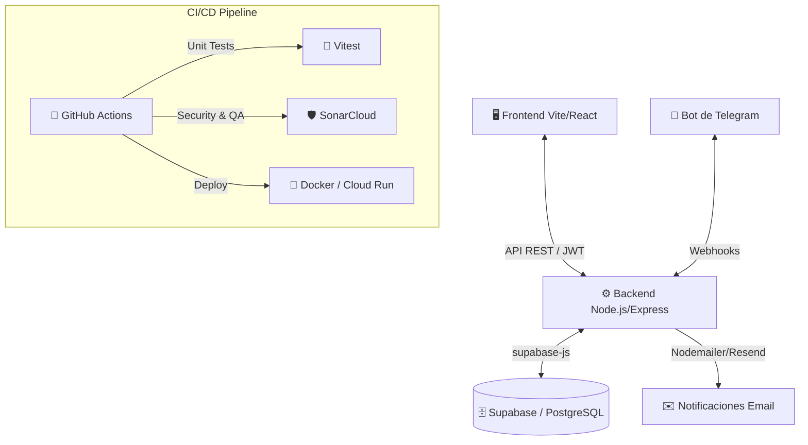

# Ecencia Andina App - Sistema Integral de Gestión, Trazabilidad y Analítica de Consumos

Este proyecto constituye la plataforma principal para la gestión automatizada de clientes, convenios corporativos, pedidos de almuerzos y reportería analítica de **Ecencia Andina**. 

Diseñado bajo altos estándares de ingeniería de software, el sistema integra interfaces modernas con flujos automatizados de interacción mediante bots, garantizando la trazabilidad operativa y el estricto cumplimiento de normativas de protección de datos.

---

## 🏗️ Arquitectura del Sistema

El proyecto está construido bajo un enfoque de **Arquitectura Monolítica Modular orientada a Servicios y Eventos (Event-Driven)**, dividida en los siguientes componentes principales:



### Componentes Core:
1. **Frontend (React + TypeScript + Vite):** Panel administrativo y operativo (Dashboard). Utiliza Tailwind CSS, componentes Shadcn/UI y Recharts para la visualización de métricas y reportería avanzada en tiempo real.
2. **Backend (Node.js + Express):** Orquestador de la lógica de negocio, reglas de validación y control de concurrencia.
3. **Bot Transaccional (Telegram API):** Módulo interactivo que permite a los usuarios realizar, modificar y cancelar reservas mediante *Inline Keyboards*. Cuenta con protección contra interacciones fantasmas y registro de trazabilidad milimétrica.
4. **Base de Datos (Supabase):** Motor PostgreSQL que gestiona datos relacionales. Asegurado a través de *Row Level Security (RLS)*.

---

## 🛡️ Características Destacadas (Capstone Features)

* **Trazabilidad de Pedidos Transaccionales:** Cada interacción en el bot de Telegram es registrada (payload, intención, resultado) en una tabla de trazabilidad enfocada a la auditoría de consumos.
* **Cumplimiento Legal y Privacidad (LOPDP):** Sistema completo de gestión de consentimiento. Los usuarios pueden solicitar qué datos se almacenan, revocar accesos y disparar flujos automáticos de eliminación de datos (`/eliminarmisdatos`, `/revocar`).
* **Calidad y Seguridad Continua (CI/CD):** Pipeline configurado en GitHub Actions que ejecuta +180 pruebas unitarias en paralelo. Conectado con **SonarCloud** para el escaneo automático de vulnerabilidades estáticas (SAST), code smells y métricas de cobertura.
* **Containerización Segura:** Despliegue empaquetado en contenedores Docker ejecutados bajo directrices de bajo privilegio (`USER node`).

---

## 🛠️ Requisitos Previos

* **Node.js** (v18+)
* **npm** o **bun**
* Cuenta de **Supabase** y **Telegram Bot Token** (vía BotFather).

---

## 🔑 Configuración de Entornos

### 1. Backend (`/backend/.env`)
Copiar `backend/.env.example` a `backend/.env` y configurar:
```env
PORT=3001
SUPABASE_URL=https://<tu-proyecto>.supabase.co
SUPABASE_SERVICE_ROLE_KEY=<tu-service-role-key-secreta>
TELEGRAM_BOT_TOKEN=<tu-bot-token>
TELEGRAM_WEBHOOK_SECRET=<tu-webhook-secret>
```
> ⚠️ **Seguridad**: El backend usa el `SERVICE_ROLE_KEY` para operaciones privilegiadas (bypass RLS). Nunca exponer en frontend.

### 2. Frontend (`/frontend/.env`)
Copiar y configurar variables expuestas:
```env
VITE_SUPABASE_PROJECT_ID="<tu-project-id>"
VITE_SUPABASE_PUBLISHABLE_KEY="<tu-publishable-anon-key>"
VITE_SUPABASE_URL="https://<tu-proyecto>.supabase.co"
```

---

## 🚀 Inicio en Entorno de Desarrollo

**1. Levantar el Backend**
```bash
cd backend
npm install
npm run dev
```
*(Correrá en http://localhost:3001)*

**2. Levantar el Frontend**
```bash
cd frontend
npm install
npm run dev
```
*(Correrá en http://localhost:5173)*

---

## 🧪 Pruebas Unitarias y Análisis (QA)

El proyecto cuenta con un entorno de pruebas rigoroso utilizando **Vitest** y reportes de cobertura en formato `lcov` (integrado con SonarCloud).

```bash
# Ejecutar pruebas y generar cobertura en backend
cd backend
npm run test:coverage

# Análisis de Linter
npm run lint
```
