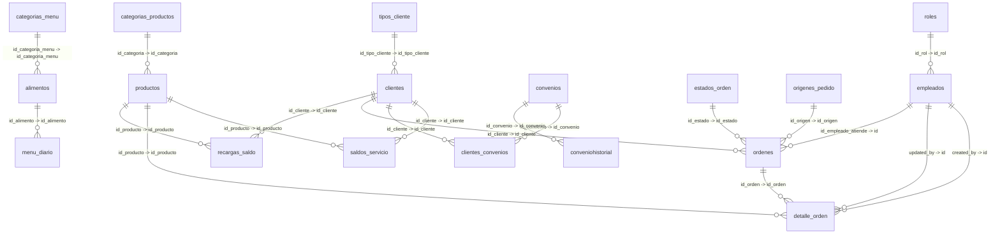

# Supabase Database Schema Walkthrough

Este documento detalla la estructura actual de las tablas, columnas, restricciones de clave primaria/foránea y relaciones obtenidas directamente desde Supabase.

## Diagrama de Entidad-Relación (ER)

## Diccionario de Datos (Tablas y Columnas)

### Tabla: `saldos_servicio`
| Columna | Tipo / Formato | Clave | Nulo? | Predeterminado | Descripción / Relación |
|---|---|---|---|---|---|
| `id_cliente` | `string (uuid)` | 🔑 PK, FK | No ⚠️ | - | **Ref: `clientes.id_cliente`** |
| `id_producto` | `integer (bigint)` | 🔑 PK, FK | No ⚠️ | - | **Ref: `productos.id_producto`** |
| `cantidad_disponible` | `integer (integer)` |  | No ⚠️ | `0` | - |
| `updated_at` | `string (timestamp with time zone)` |  | Sí | `now()` | - |
| `updated_by` | `string (uuid)` |  | Sí | - | - |

### Tabla: `productos`
| Columna | Tipo / Formato | Clave | Nulo? | Predeterminado | Descripción / Relación |
|---|---|---|---|---|---|
| `id_producto` | `integer (bigint)` | 🔑 PK | No ⚠️ | - | - |
| `id_categoria` | `integer (bigint)` | 🔗 FK | Sí | - | Note: | **Ref: `categorias_productos.id_categoria`** |
| `nombre_producto` | `string (text)` |  | No ⚠️ | - | - |
| `precio_unitario` | `number (numeric)` |  | No ⚠️ | - | - |
| `created_at` | `string (timestamp with time zone)` |  | Sí | `now()` | - |
| `created_by` | `string (uuid)` |  | Sí | - | - |
| `updated_at` | `string (timestamp with time zone)` |  | Sí | `now()` | - |
| `updated_by` | `string (uuid)` |  | Sí | - | - |
| `esta_activo` | `boolean (boolean)` |  | Sí | `true` | - |
| `descripcion` | `string (text)` |  | Sí | - | - |

### Tabla: `categorias_productos`
| Columna | Tipo / Formato | Clave | Nulo? | Predeterminado | Descripción / Relación |
|---|---|---|---|---|---|
| `id_categoria` | `integer (bigint)` | 🔑 PK | No ⚠️ | - | - |
| `nombre_categoria` | `string (text)` |  | No ⚠️ | - | - |
| `created_at` | `string (timestamp with time zone)` |  | Sí | `now()` | - |
| `created_by` | `string (uuid)` |  | Sí | - | - |

### Tabla: `detalle_orden`
| Columna | Tipo / Formato | Clave | Nulo? | Predeterminado | Descripción / Relación |
|---|---|---|---|---|---|
| `id_detalle` | `string (uuid)` | 🔑 PK | No ⚠️ | `gen_random_uuid()` | - |
| `id_orden` | `string (uuid)` | 🔗 FK | Sí | - | Note: | **Ref: `ordenes.id_orden`** |
| `id_producto` | `integer (bigint)` | 🔗 FK | Sí | - | Note: | **Ref: `productos.id_producto`** |
| `cantidad` | `integer (integer)` |  | No ⚠️ | - | - |
| `precio_aplicado` | `number (numeric)` |  | No ⚠️ | - | - |
| `updated_at` | `string (timestamp with time zone)` |  | Sí | `now()` | - |
| `created_by` | `string (uuid)` | 🔗 FK | Sí | - | Note: | **Ref: `empleados.id`** |
| `updated_by` | `string (uuid)` | 🔗 FK | Sí | - | Note: | **Ref: `empleados.id`** |
| `opciones` | `undefined (jsonb)` |  | Sí | - | - |

### Tabla: `clientes_convenios`
| Columna | Tipo / Formato | Clave | Nulo? | Predeterminado | Descripción / Relación |
|---|---|---|---|---|---|
| `id_cliente` | `string (uuid)` | 🔑 PK, FK | No ⚠️ | - | **Ref: `clientes.id_cliente`** |
| `id_convenio` | `string (uuid)` | 🔑 PK, FK | No ⚠️ | - | **Ref: `convenios.id_convenio`** |
| `created_at` | `string (timestamp with time zone)` |  | Sí | `now()` | - |
| `created_by` | `string (uuid)` |  | Sí | - | - |

### Tabla: `ordenes`
| Columna | Tipo / Formato | Clave | Nulo? | Predeterminado | Descripción / Relación |
|---|---|---|---|---|---|
| `id_orden` | `string (uuid)` | 🔑 PK | No ⚠️ | `gen_random_uuid()` | - |
| `id_cliente` | `string (uuid)` | 🔗 FK | Sí | - | Note: | **Ref: `clientes.id_cliente`** |
| `id_estado` | `integer (bigint)` | 🔗 FK | Sí | - | Note: | **Ref: `estados_orden.id_estado`** |
| `id_origen` | `integer (bigint)` | 🔗 FK | Sí | - | Note: | **Ref: `origenes_pedido.id_origen`** |
| `canal_origen` | `string (text)` |  | Sí | - | - |
| `created_at` | `string (timestamp with time zone)` |  | Sí | `now()` | - |
| `created_by` | `string (uuid)` |  | Sí | - | - |
| `observaciones` | `string (text)` |  | Sí | - | - |
| `id_empleado_atiende` | `string (uuid)` | 🔗 FK | Sí | - | Note: | **Ref: `empleados.id`** |
| `metodo_pago` | `string (text)` |  | Sí | - | - |
| `updated_at` | `string (timestamp with time zone)` |  | Sí | `now()` | - |
| `updated_by` | `string (uuid)` |  | Sí | - | - |

### Tabla: `menu_diario`
| Columna | Tipo / Formato | Clave | Nulo? | Predeterminado | Descripción / Relación |
|---|---|---|---|---|---|
| `id_menu_diario` | `string (uuid)` | 🔑 PK | No ⚠️ | `gen_random_uuid()` | - |
| `fecha` | `string (date)` |  | No ⚠️ | - | - |
| `id_alimento` | `integer (bigint)` | 🔗 FK | Sí | - | Note: | **Ref: `alimentos.id_alimento`** |
| `created_at` | `string (timestamp with time zone)` |  | Sí | `now()` | - |
| `created_by` | `string (uuid)` |  | Sí | - | - |

### Tabla: `conveniohistorial`
| Columna | Tipo / Formato | Clave | Nulo? | Predeterminado | Descripción / Relación |
|---|---|---|---|---|---|
| `id` | `string (uuid)` | 🔑 PK | No ⚠️ | `gen_random_uuid()` | - |
| `id_convenio` | `string (uuid)` | 🔗 FK | Sí | - | Note: | **Ref: `convenios.id_convenio`** |
| `fecha_inicio` | `string (date)` |  | No ⚠️ | - | - |
| `fecha_caducidad` | `string (date)` |  | No ⚠️ | - | - |
| `archivo_firmado` | `string (text)` |  | Sí | - | - |
| `fecha_registro` | `string (timestamp with time zone)` |  | Sí | `now()` | - |

### Tabla: `origenes_pedido`
| Columna | Tipo / Formato | Clave | Nulo? | Predeterminado | Descripción / Relación |
|---|---|---|---|---|---|
| `id_origen` | `integer (bigint)` | 🔑 PK | No ⚠️ | - | - |
| `nombre_origen` | `string (text)` |  | No ⚠️ | - | - |

### Tabla: `tipos_cliente`
| Columna | Tipo / Formato | Clave | Nulo? | Predeterminado | Descripción / Relación |
|---|---|---|---|---|---|
| `id_tipo_cliente` | `integer (bigint)` | 🔑 PK | No ⚠️ | - | - |
| `nombre_tipo` | `string (text)` |  | No ⚠️ | - | - |

### Tabla: `alimentos`
| Columna | Tipo / Formato | Clave | Nulo? | Predeterminado | Descripción / Relación |
|---|---|---|---|---|---|
| `id_alimento` | `integer (bigint)` | 🔑 PK | No ⚠️ | - | - |
| `id_categoria_menu` | `integer (bigint)` | 🔗 FK | Sí | - | Note: | **Ref: `categorias_menu.id_categoria_menu`** |
| `nombre_alimento` | `string (text)` |  | No ⚠️ | - | - |
| `created_at` | `string (timestamp with time zone)` |  | Sí | `now()` | - |
| `created_by` | `string (uuid)` |  | Sí | - | - |
| `updated_at` | `string (timestamp with time zone)` |  | Sí | `now()` | - |
| `updated_by` | `string (uuid)` |  | Sí | - | - |

### Tabla: `recargas_saldo`
| Columna | Tipo / Formato | Clave | Nulo? | Predeterminado | Descripción / Relación |
|---|---|---|---|---|---|
| `id_recarga` | `string (uuid)` | 🔑 PK | No ⚠️ | `gen_random_uuid()` | - |
| `id_cliente` | `string (uuid)` | 🔗 FK | Sí | - | Note: | **Ref: `clientes.id_cliente`** |
| `id_producto` | `integer (bigint)` | 🔗 FK | Sí | - | Note: | **Ref: `productos.id_producto`** |
| `cantidad_comprada` | `integer (integer)` |  | No ⚠️ | - | - |
| `monto_total` | `number (numeric)` |  | No ⚠️ | - | - |
| `created_at` | `string (timestamp with time zone)` |  | Sí | `now()` | - |
| `created_by` | `string (uuid)` |  | Sí | - | - |
| `updated_at` | `string (timestamp with time zone)` |  | Sí | `now()` | - |
| `updated_by` | `string (uuid)` |  | Sí | - | - |
| `numero_factura` | `string (character varying)` |  | Sí | - | - |

### Tabla: `categorias_menu`
| Columna | Tipo / Formato | Clave | Nulo? | Predeterminado | Descripción / Relación |
|---|---|---|---|---|---|
| `id_categoria_menu` | `integer (bigint)` | 🔑 PK | No ⚠️ | - | - |
| `nombre_categoria` | `string (text)` |  | No ⚠️ | - | - |
| `created_at` | `string (timestamp with time zone)` |  | Sí | `now()` | - |
| `created_by` | `string (uuid)` |  | Sí | - | - |
| `updated_at` | `string (timestamp with time zone)` |  | Sí | `now()` | - |
| `updated_by` | `string (uuid)` |  | Sí | - | - |

### Tabla: `convenios`
| Columna | Tipo / Formato | Clave | Nulo? | Predeterminado | Descripción / Relación |
|---|---|---|---|---|---|
| `id_convenio` | `string (uuid)` | 🔑 PK | No ⚠️ | `gen_random_uuid()` | - |
| `ruc` | `string (text)` |  | No ⚠️ | - | - |
| `nombre_empresa` | `string (text)` |  | No ⚠️ | - | - |
| `representante` | `string (text)` |  | Sí | - | - |
| `telefono` | `string (text)` |  | Sí | - | - |
| `email` | `string (text)` |  | Sí | - | - |
| `fecha_inicio` | `string (date)` |  | No ⚠️ | - | - |
| `fecha_caducidad` | `string (date)` |  | No ⚠️ | - | - |
| `esta_activo` | `boolean (boolean)` |  | Sí | `true` | - |
| `created_at` | `string (timestamp with time zone)` |  | Sí | `now()` | - |
| `created_by` | `string (uuid)` |  | Sí | - | - |
| `updated_at` | `string (timestamp with time zone)` |  | Sí | `now()` | - |
| `updated_by` | `string (uuid)` |  | Sí | - | - |
| `cupo_maximo` | `integer (integer)` |  | Sí | `0` | - |
| `archivo_firmado` | `string (text)` |  | Sí | - | - |

### Tabla: `clientes`
| Columna | Tipo / Formato | Clave | Nulo? | Predeterminado | Descripción / Relación |
|---|---|---|---|---|---|
| `id_cliente` | `string (uuid)` | 🔑 PK | No ⚠️ | `gen_random_uuid()` | - |
| `id_tipo_cliente` | `integer (bigint)` | 🔗 FK | Sí | - | Note: | **Ref: `tipos_cliente.id_tipo_cliente`** |
| `cedula` | `string (text)` |  | No ⚠️ | - | - |
| `nombre` | `string (text)` |  | No ⚠️ | - | - |
| `apellido` | `string (text)` |  | No ⚠️ | - | - |
| `telefono` | `string (text)` |  | Sí | - | - |
| `esta_activo` | `boolean (boolean)` |  | Sí | `true` | - |
| `created_at` | `string (timestamp with time zone)` |  | Sí | `now()` | - |
| `created_by` | `string (uuid)` |  | Sí | - | - |
| `updated_at` | `string (timestamp with time zone)` |  | Sí | `now()` | - |
| `updated_by` | `string (uuid)` |  | Sí | - | - |

### Tabla: `roles`
| Columna | Tipo / Formato | Clave | Nulo? | Predeterminado | Descripción / Relación |
|---|---|---|---|---|---|
| `id_rol` | `integer (bigint)` | 🔑 PK | No ⚠️ | - | - |
| `nombre_rol` | `string (text)` |  | No ⚠️ | - | - |
| `created_at` | `string (timestamp with time zone)` |  | Sí | `now()` | - |
| `created_by` | `string (uuid)` |  | Sí | - | - |
| `updated_at` | `string (timestamp with time zone)` |  | Sí | `now()` | - |
| `updated_by` | `string (uuid)` |  | Sí | - | - |

### Tabla: `empleados`
| Columna | Tipo / Formato | Clave | Nulo? | Predeterminado | Descripción / Relación |
|---|---|---|---|---|---|
| `id` | `string (uuid)` | 🔑 PK | No ⚠️ | - | - |
| `id_rol` | `integer (bigint)` | 🔗 FK | Sí | - | Note: | **Ref: `roles.id_rol`** |
| `nombre` | `string (text)` |  | No ⚠️ | - | - |
| `apellido` | `string (text)` |  | No ⚠️ | - | - |
| `nombre_usuario` | `string (text)` |  | No ⚠️ | - | - |
| `correo` | `string (text)` |  | Sí | - | - |
| `esta_activo` | `boolean (boolean)` |  | Sí | `true` | - |
| `created_at` | `string (timestamp with time zone)` |  | Sí | `now()` | - |
| `created_by` | `string (uuid)` |  | Sí | - | - |
| `updated_at` | `string (timestamp with time zone)` |  | Sí | `now()` | - |
| `updated_by` | `string (uuid)` |  | Sí | - | - |

### Tabla: `estados_orden`
| Columna | Tipo / Formato | Clave | Nulo? | Predeterminado | Descripción / Relación |
|---|---|---|---|---|---|
| `id_estado` | `integer (bigint)` | 🔑 PK | No ⚠️ | - | - |
| `nombre_estado` | `string (text)` |  | No ⚠️ | - | - |